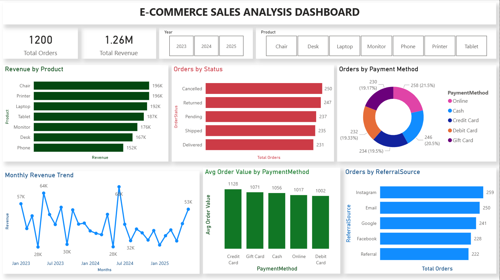

# DecodeLabs Data Analytics Internship — Task Submissions

## About Me
**Name:** Adeniji Shukraat Opeyemi
**Domain:** Data Analytics
**Batch:** 2026
**Organization:** DecodeLabs

---

## Project 2: Exploratory Data Analysis (EDA)

### Dataset
E-Commerce Orders Dataset — 1,200 records spanning January 2023 to June 2025

### Tool Used
Microsoft Excel

### Objective
To explore patterns, trends, distributions and outliers in e-commerce order data 
and generate actionable business insights.

### Key Findings
- Nearly 40% of orders resulted in a Return or Cancellation — a critical fulfilment issue
- Revenue declined 10% from 2023 ($552,643) to 2024 ($480,236)
- 8 high-value outlier orders were identified using the IQR method — 
  50% ended in Return or Cancellation
- Instagram is the strongest customer acquisition channel at 21.6% of orders
- Order value is right-skewed — median ($824) is a more reliable measure 
  than mean ($1,054)

### Sheets Included
- Data Profile
- Descriptive Stats
- Categorical Analysis
- Trend Analysis
- Outlier Detection

---

## Project 3: SQL Data Analysis

### Dataset
E-Commerce Orders Dataset — 1,200 records

### Tool Used
SQL Server Management Studio (SSMS)

### Objective
To extract business insights from an e-commerce dataset using 
SQL queries including SELECT, WHERE, GROUP BY, HAVING, 
ORDER BY and aggregate functions.

### Queries Written
- Query 1: View dataset (SELECT, TOP)
- [Query 1 Results](screenshots/query1_view_data.png)
- Query 2: Order count per product (COUNT, GROUP BY)
- [Query 2 Results](screenshots/query2_order_per_product.png)
- Query 3: Total revenue per product (SUM, GROUP BY)
- [Query 3 Results](screenshots/query3_revenue_per_product.png)
- Query 4: Average order value per payment method (AVG, GROUP BY)
- [Query 4 Results](screenshots/query4_average_order_value_per_payment_method.png)
- Query 5: Filter delivered orders (WHERE)
- [Query 5 Results](screenshots/query5_only_delivered_goods.png)
- Query 6: Delivered orders by Credit Card (WHERE + AND)
- [Query 6 Results](screenshots/query6_delivered_orders_paid_by_credit_card.png)
- Query 7: Top 10 highest value orders (TOP, ORDER BY)
- [Query 7 Results](screenshots/query7_top_highest_value_orders.png)
- Query 8: Orders per referral source (COUNT, ORDER BY)
- [Query 8 Results](screenshots/query8_orders_per_referral_Source.png)
- Query 9: Products with over 170 orders (HAVING)
- [Query 9 Results](query9_products_with_more_than_170_orders.png)
- Query 10: Returned and cancelled orders (WHERE IN)
- [Query 10 Results](screenshots/query10_returned_and_cancelled_orders.png)

### Key Findings
- Chair generates the highest revenue at $195,620 despite not 
  having the most orders
- 497 orders (41.4%) were either Returned or Cancelled — 
  a critical business problem
- Instagram is the strongest acquisition channel at 259 orders
- Credit Card customers have the highest average order value
- Only 4 of 7 products exceeded 170 orders: Printer, Tablet, 
  Chair and Laptop

---

## Project 4: Data Visualization — Power BI Dashboard

### Dataset
E-Commerce Orders Dataset — 1,200 records spanning January 2023 to June 2025

### Tool Used
Microsoft Power BI Desktop

### Objective
To build a fully interactive dashboard that visualizes the key findings 
from the EDA and SQL analysis, enabling stakeholders to explore 
e-commerce performance at a glance.

### Dashboard Components
- KPI Card: Total Orders (1,200)
- KPI Card: Total Revenue ($1.26M)
- Bar Chart: Revenue by Product
- Bar Chart: Orders by Order Status
- Bar Chart: Orders by Referral Source
- Column Chart: Average Order Value by Payment Method
- Line Chart: Monthly Revenue Trend (Jan 2023 — Jun 2025)
- Donut Chart: Orders by Payment Method
- Slicer: Filter by Year
- Slicer: Filter by Product

### Key Findings Visualized
- Chair generates the highest revenue at $196K despite not 
  leading in order count
- 497 orders (41.4%) resulted in Cancellation or Return — 
  Delivered is the lowest status at only 231 orders
- Sharp revenue dips occur every August in both 2023 and 2024 
  suggesting seasonal patterns
- All 5 payment methods share almost equal order distribution 
  (19-21% each)
- Credit Card customers have the highest average order value 
  at $1,128
- Instagram is the strongest customer acquisition channel at 
  259 orders

### Files Included
- Project4_PowerBI_Dashboard.pbix — Interactive dashboard file
- Project4_Dashboard_Preview.pdf — Static PDF preview
- screenshots/Project4_PowerBI_Dashboard.png — Dashboard screenshot

### Dashboard Preview

